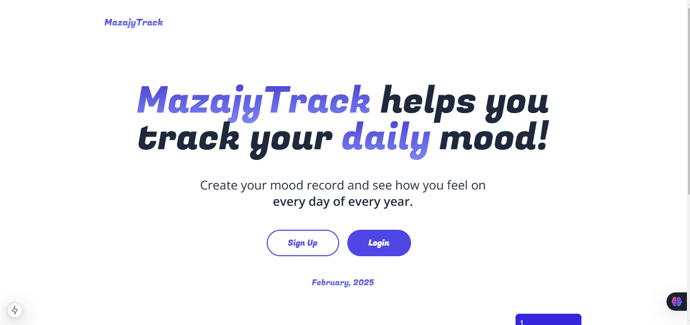
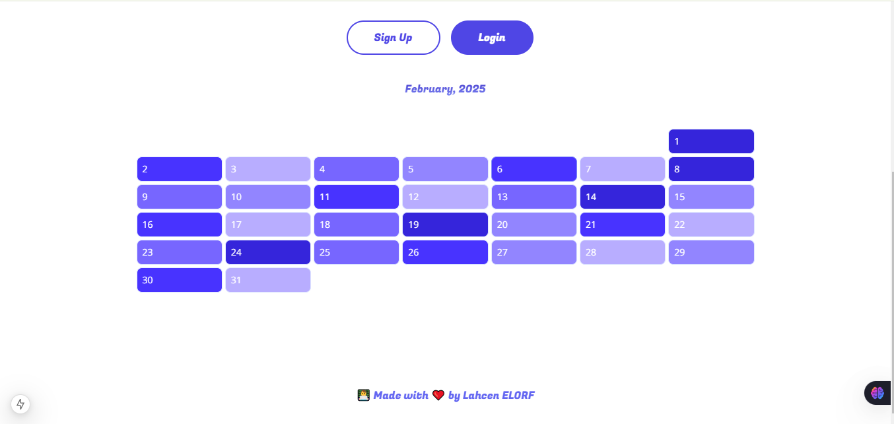
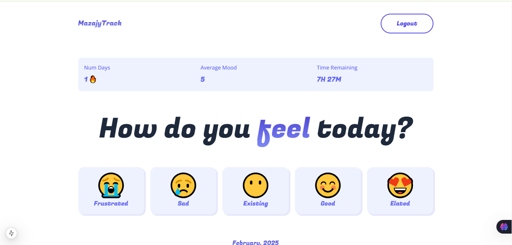
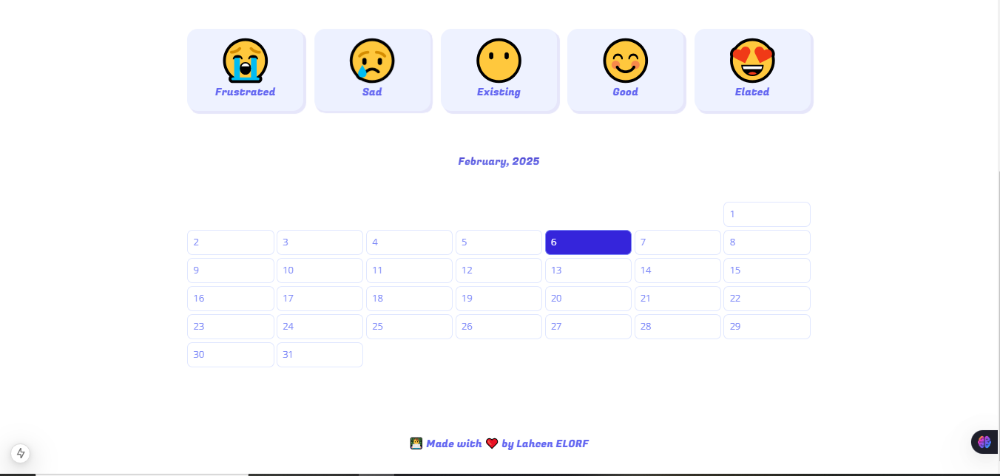
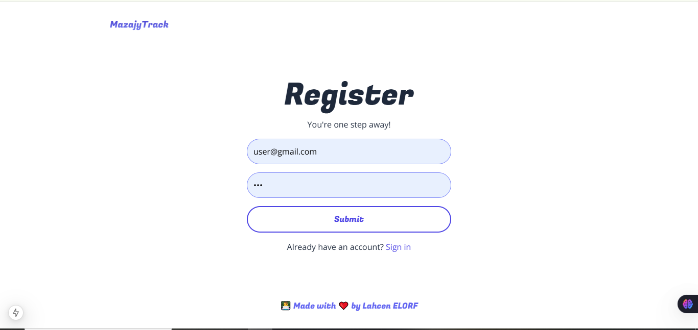
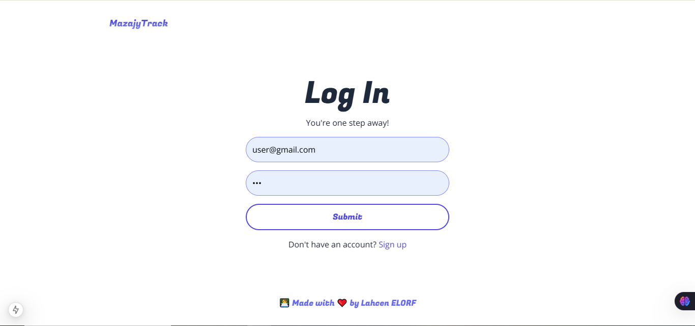

# 🌟 Mazajy Track - Mood Tracking App

A **Full-Stack Mood Tracking Application** built with **Next.js**, **Firebase**, and **TailwindCSS**. This app allows users to track their daily emotions, visualize mood trends, and manage their data in real-time with a clean and modern user interface.

---

## 🌐 Personal Links
- [🌐 LinkedIn](https://www.linkedin.com/in/lahcenelorf/)
- [👨‍💻 GitHub](https://github.com/ELORF-Lahcen)

---

## 🔗 Technologies Used
<div align="center">
    
    
    
    
</div>

---

## 📌 Features

- 🔐 **User Authentication**: Secure login and signup using Firebase Authentication.
- 📊 **Mood Tracking**: Log daily emotions and track mood trends over time.
- 📈 **Data Visualization**: Visualize mood data with interactive charts.
- 🎨 **Modern UI**: A clean and responsive design built with TailwindCSS.
- 🔄 **Real-Time Updates**: Seamless data management with Firebase Firestore.

---

## 🛠️ Tech Stack

- **Next.js 15.1.6**: Framework for server-rendered React applications.
- **Firebase 11.2.0**: For authentication and real-time database management.
- **TailwindCSS**: Utility-first CSS framework for styling.
- **React 19.0.0**: JavaScript library for building user interfaces.

---

## 🛠️ Setup Instructions

1. **Clone the repository**:
   ```bash
   git clone https://github.com/ELORF-Lahcen/mazajy-track.git
   ```
2. **Install dependencies**:
   ```bash
   cd mazajy-track
   npm install
   ```
3. **Set up Firebase**:
   - Create a Firebase project at **Firebase Console**.
   - Add your Firebase configuration in **firebase.js**.
4. **Run the development server**:
   ```bash
   npm run dev
   ```
5. **Open the app**:
   - Visit **http://localhost:3000** in your browser.

--- 

## 📂 Project Structure

```plaintext
mazajy-track/
├── app/                  # Next.js app directory
├── components/           # Reusable React components
├── context/              # React context for state management
├── public/               # Static assets
├── utils/                # Utility functions
├── .gitignore            # Git ignore file
├── README.md             # Project documentation
├── eslint.config.mjs     # ESLint configuration
├── firebase.js           # Firebase configuration
├── jsconfig.json         # JavaScript configuration
├── next.config.mjs       # Next.js configuration
├── package-lock.json     # Dependency lock file
├── package.json          # Project dependencies
├── postcss.config.mjs    # PostCSS configuration
└── tailwind.config.mjs   # TailwindCSS configuration
```

--- 

## 📸 Screenshots

1- **Home Page**





2- **Dashboard**





3- **Signup Page**



3- **Login Page**



---

## 🤝 Contributing

Contributions are welcome! If you have suggestions or improvements, please open a pull request.

1. Fork the project.
2. Create a new feature branch (`git checkout -b feature/YourFeature`).
3. Commit your changes (`git commit -m 'Add YourFeature'`).
4. Push to your branch (`git push origin feature/YourFeature`).
5. Open a Pull Request.

---

👨‍💻 Made with ❤️ by [Lahcen ELORF](https://github.com/elorf-lahcen)
